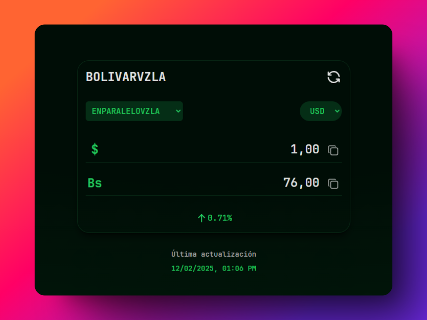

# [BolivarVzla](https://bolivarvzla.netlify.app/)

  

Este proyecto es una página web que permite consultar el precio del dólar y el euro en bolívares y viceversa, utilizando la API de Pydolarvzla. Está basado en la página https://alcambio.app/ y desarrollado con HTML, CSS, React y TypeScript.

La página web está alojada en Netlify. Puedes acceder a la aplicación en el siguiente enlace: [BolivarVzla](https://bolivarvzla.netlify.app/)

## Características

- Consulta en tiempo real los precios del dólar y el euro en bolívares.
- Elige el monitor que deseas seguir, como Enparalelo, BCV, Binance, Paypal o Cripto Dólar, entre otros.
- Ingresa el monto que desees y obtén la conversión a la otra moneda.
- Visualiza el porcentaje de cambio de cada moneda.
- Copia fácilmente el resultado para utilizarlo donde necesites.
- Visualiza la fecha de la última actualización del precio de la moneda.
- Interfaz intuitiva y elegante.

## Tecnologías Utilizadas

- **HTML**: Para la estructura del sitio web.
- **CSS**: Para el diseño y la presentación visual.
- **React**: Para construir la interfaz de usuario.
- **TypeScript**: Para asegurar un código más robusto y menos propenso a errores.
- **API de Pydolarvzla**: Para obtener los datos de cambio de moneda.

## Contribuciones

Las contribuciones son bienvenidas. Si deseas colaborar, por favor abre un issue o envía un pull request con tus cambios propuestos.

## Licencia

Este proyecto está licenciado bajo la Licencia MIT. Consulta el archivo LICENSE para más detalles.

## Contacto

Si tienes alguna pregunta o comentario, no dudes en ponerte en contacto conmigo a través de [tu correo electrónico] o abre un issue en el repositorio.

---

¡Gracias por visitar y usar esta aplicación! Espero que te sea útil para tus necesidades de consulta de cambio de moneda.
